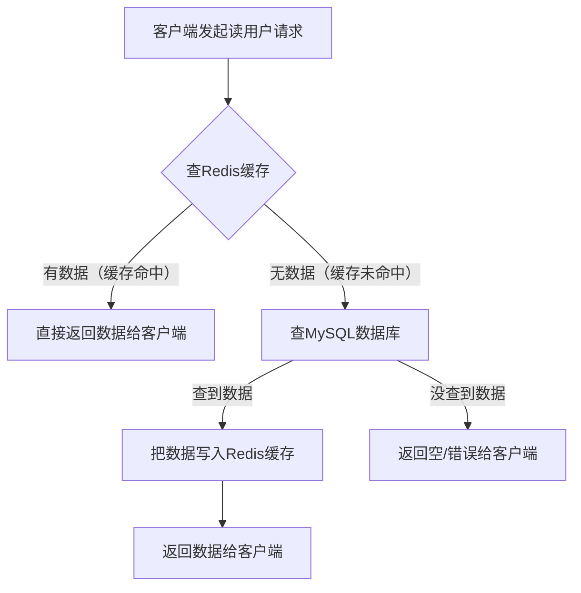
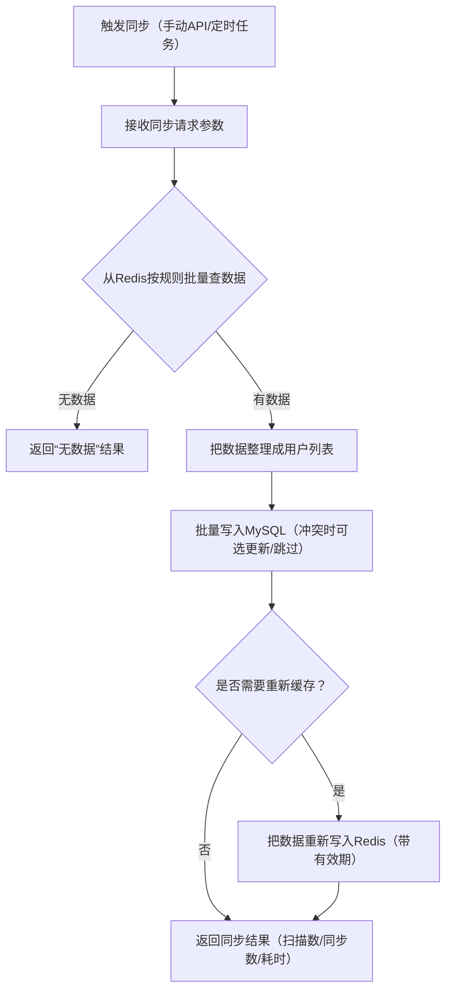
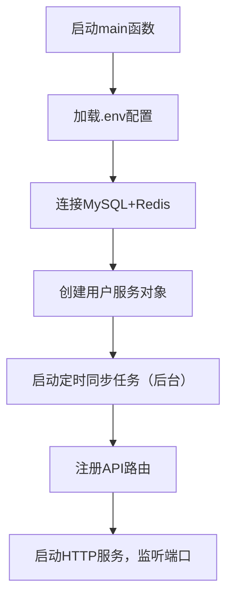

# AbstractManager 缓存管理框架 - 使用指南

## 目录

- [项目概述](#项目概述)
- [快速开始](#快速开始)
- [示例代码解读](#示例代码解读)
- [API 接口详解](#api-接口详解)
- [过滤器系统](#过滤器系统)
- [未来功能预告](#未来功能预告)

---

## 项目概述

AbstractManager 是一个基于 Go 的缓存管理框架，旨在简化 Redis 缓存与数据库之间的数据同步操作。本框架提供了：

- **统一的缓存写入接口**：支持单条、批量、版本化写入
- **灵活的缓存查询能力**：支持模式匹配、条件过滤、自定义业务过滤器
- **分层架构设计**：清晰分离环境初始化、基础设施、业务服务和 HTTP 路由层
- **高性能批量操作**：使用 Redis Pipeline 和 MGET 优化批量读写性能

---

## 快速开始

### 环境要求

- Go 1.24
- Redis 服务
- MySQL/PostgreSQL 等关系型数据库

### 配置环境变量

创建 `.env` 文件：

```env
DB_USER=your_db_user
DB_PASSWORD=your_db_password
DB_HOST=localhost
DB_PORT=3306
DB_NAME=your_database

# Redis 配置
REDIS_HOST=127.0.0.1
REDIS_PORT=6379

# 服务配置
SERVER_PORT=8080


# Cache Aside Configuration
# TTL when data is loaded from DB and cached (seconds)
CACHE_ASIDE_TTL=11  

# Refresh TTL on cache hit
# true: extend cache lifetime on every read
# false: keep original TTL
CACHE_HIT_REFRESH=false
```

### 运行示例

```bash
 go run "example\dataConsistency_db_cache_example\ddce_main.go"
```

服务将在 `http://localhost:8080` 启动。

---

## 示例代码解读

- [示例代码](./example/dataConsistency_db_cache_example/ddce_main.go)

### 整体架构

示例代码采用**四层架构**设计：

```
┌─────────────────────────────────────┐
│   1. 环境初始化层 (initEnv)          │  加载 .env 配置
├─────────────────────────────────────┤
│   2. 基础设施层 (initInfra)          │  初始化 DB、Redis 连接
├─────────────────────────────────────┤
│   3. 业务服务层 (initServices)       │  构建 ServiceManager
├─────────────────────────────────────┤
│   4. HTTP 路由层 (initRouter)        │  注册 API 端点
└─────────────────────────────────────┘
```

事先说明流程：

**1. Cache Aside 读数据流程**


**2. 缓存→数据库同步流程**


**3. 程序启动整体流程**

### 关键组件说明

#### 1. 环境初始化层
```go
func initEnv() {
    _ = godotenv.Load()
    // 加载 .env 文件中的环境变量
}
```
**职责**：仅负责加载运行环境，不涉及任何业务逻辑。

#### 2. 基础设施层
```go
func initInfra() (*service.DBManager, *service.RedisManager) {
    dbManager, _ := service.InitDB()
    redisManager, _ := service.InitRedis()
    return dbManager, redisManager
}
```
**职责**：创建数据库和 Redis 连接管理器，确保资源正确释放。

#### 3. 业务服务层
```go
func initServices() *service.ServiceManager[model.User] {
    userSvc := service.NewServiceManager(model.User{})
    userSvc.Create(ctx, &service.CreateOptions{IfNotExists: true})
    return userSvc
}
```
**职责**：创建针对 `User` 模型的 ServiceManager，负责业务逻辑但不知道 HTTP 层细节。

#### 4. HTTP 路由层
```go
func initRouter(userSvc *service.ServiceManager[model.User]) *gin.Engine {
    r := gin.Default()
    registerUserWriteRoutes(r, userSvc)   // 写入路由
    registerUserLookupRoutes(r, userSvc)  // 查询路由
    return r
}
```
**职责**：将业务服务暴露为 RESTful API。

### 自定义业务过滤器示例

```go
func activeUserFilter(
    ctx context.Context,
    client *redis.Client,
    keys []string,
) ([]string, error) {
    // 使用 Pipeline 批量获取 status 字段
    pipe := client.Pipeline()
    statusCmds := make(map[string]*redis.StringCmd, len(keys))
    
    for _, key := range keys {
        statusCmds[key] = pipe.HGet(ctx, key, "status")
    }
    
    pipe.Exec(ctx)
    
    // 筛选 status == "1" 的活跃用户
    var activeKeys []string
    for key, cmd := range statusCmds {
        if status, _ := cmd.Result(); status == "1" {
            activeKeys = append(activeKeys, key)
        }
    }
    return activeKeys, nil
}
```

### 数据库批落库 核心逻辑示例讲解

```go
// --- 核心同步逻辑 ---
func syncCacheToDatabase(
	ctx context.Context,
	userSvc *service.ServiceManager[model.User],
	req *CacheToDBRequest,
) (*CacheToDBResult, error) {
	startTime := time.Now()
	if req.BatchSize <= 0 {
		req.BatchSize = 500
	}

	// Step 1: 从 Redis 批量获取数据
	userMap, err := userSvc.LookupQueryByPattern(ctx, req.KeyPattern, &service.LookupQueryOptions{
		FallbackToDB: false,
	})
	if err != nil {
		return nil, fmt.Errorf("lookup failed: %w", err)
	}

	users := make([]model.User, 0, len(userMap))
	for _, u := range userMap {
		if u != nil {
			users = append(users, *u)
		}
	}

	if len(users) == 0 {
		return &CacheToDBResult{
			Duration: time.Since(startTime),
			Mode:     "no_data",
		}, nil
	}

	// Step 2: 批量写入数据库
	err = userSvc.SetQuery(ctx, users, &service.SetQueryOptions{
		BatchSize:        req.BatchSize,
		OnConflictUpdate: req.ConflictStrategy != "skip",
		InvalidateCache:  false,
	})
	if err != nil {
		return nil, fmt.Errorf("db write failed: %w", err)
	}

	result := &CacheToDBResult{
		TotalScanned: len(userMap),
		TotalSynced:  len(users),
		Duration:     time.Since(startTime),
		Mode:         "cache_aside",
	}

	// Step 3: Cache Aside 模式 - 落库后重新缓存
	if req.RecacheAfterSync {
		recached, err := recacheUsers(ctx, users, getCacheAsideTTL())
		if err != nil {
			log.Printf("Recache warning: %v", err)
		} else {
			result.RecachedItems = recached
			log.Printf("Synced %d items, recached with TTL %v", len(users), getCacheAsideTTL())
		}
	} else {
		log.Printf("Synced %d items to DB", len(users))
	}

	return result, nil
}

// recacheUsers 重新缓存用户数据
func recacheUsers(ctx context.Context, users []model.User, ttl time.Duration) (int, error) {
	rdb := service.GetRedis()
	pipe := rdb.Pipeline()

	for _, user := range users {
		key := fmt.Sprintf("user:%d", user.ID)
		jsonData, err := json.Marshal(user)
		if err != nil {
			log.Printf("Marshal error for user %d: %v", user.ID, err)
			continue
		}
		pipe.Set(ctx, key, jsonData, ttl)
	}

	_, err := pipe.Exec(ctx)
	if err != nil {
		return 0, fmt.Errorf("pipeline exec failed: %w", err)
	}

	return len(users), nil
}

// --- 配置辅助函数 ---

func getCacheAsideTTL() time.Duration {
	if ttlStr := os.Getenv("CACHE_ASIDE_TTL"); ttlStr != "" {
		if ttl, err := strconv.Atoi(ttlStr); err == nil {
			return time.Duration(ttl) * time.Second
		}
	}
	return 1 * time.Hour
}

func getCacheHitRefresh() bool {
	return os.Getenv("CACHE_HIT_REFRESH") == "true"
}

func getEnvOrDefault(key, defaultValue string) string {
	if v := os.Getenv(key); v != "" {
		return v
	}
	return defaultValue
}

// --- 定时同步任务 ---

func startPeriodicSync(ctx context.Context, userSvc *service.ServiceManager[model.User]) {
	ticker := time.NewTicker(10 * time.Second)
	defer ticker.Stop()

	for {
		select {
		case <-ticker.C:
			log.Println("🔄 Auto sync...")

			result, err := syncCacheToDatabase(ctx, userSvc, &CacheToDBRequest{
				KeyPattern:       "user:*",
				ConflictStrategy: "upsert",
				RecacheAfterSync: false, // 落库后不重新缓存，避免无限刷新 TTL
			})

			if err != nil {
				log.Printf("❌ Sync failed: %v", err)
			} else if result.TotalSynced > 0 {
				log.Printf("Synced: %d items, took: %v (no recache)",
					result.TotalSynced, result.Duration)
			}
		case <-ctx.Done():
			return
		}
	}
}
```
（需要补充）

以及数据从缓存中读取自己支持cache-aside，下面是cache-aside的讲解：

### cache-aside的讲解

```go

// ========== 核心查询逻辑 ==========

func (lrg *LookupRouterGroup[T]) executeLookup(
	ctx context.Context,
	keyPattern string,
	filters []filter_translator.FilterParam,
	useCustomFilter bool,
	fallbackToDB bool,
) (map[string]*T, []string, error) {

	// 1. 获取所有匹配的键
	redisClient := service.GetRedis()
	allKeys, err := redisClient.Keys(ctx, keyPattern).Result()
	if err != nil {
		return nil, nil, fmt.Errorf("failed to get keys: %w", err)
	}

	// 2. 应用自定义过滤（如果启用）
	if useCustomFilter && lrg.customFilterFunc != nil {
		allKeys, err = lrg.customFilterFunc(ctx, redisClient, allKeys)
		if err != nil {
			return nil, nil, fmt.Errorf("custom filter failed: %w", err)
		}
	}

	// 3. 翻译并应用通用过滤器
	if len(filters) > 0 {
		redisFilters, err := lrg.TranslatorRegistry.TranslateBatch(filters)
		if err != nil {
			return nil, nil, fmt.Errorf("invalid filters: %w", err)
		}

		allKeys, err = filter_translator.ApplyRedisFilters(ctx, redisClient, allKeys, redisFilters)
		if err != nil {
			return nil, nil, fmt.Errorf("filter application failed: %w", err)
		}
	}

	// 只保留普通对象 key
	filteredKeys := make([]string, 0, len(allKeys))
	for _, k := range allKeys {
		if !strings.HasSuffix(k, ":version") && !strings.HasSuffix(k, ":meta") {
			filteredKeys = append(filteredKeys, k)
		}
	}
	allKeys = filteredKeys

	// 如果 Redis 没有数据
	// 1. 有 filters 时，总是从 DB 查询（因为可能缓存中没有符合条件的数据）
	// 2. 无 filters 且 fallback_db=true 时，从 DB 加载所有数据
	if len(allKeys) == 0 {
		if len(filters) > 0 || fallbackToDB {
			return lrg.loadFromDBAndCache(ctx, keyPattern, filters)
		}
		return make(map[string]*T), []string{}, nil
	}

	// 4. 从缓存查询数据
	opts := &service.LookupQueryOptions{
		KeyPattern:   keyPattern,
		CacheExpire:  lrg.defaultCacheExpire,
		FallbackToDB: fallbackToDB,
	}

	result, err := lrg.Service.LookupQuery(ctx, allKeys, opts)
	if err != nil {
		return nil, nil, fmt.Errorf("lookup query failed: %w", err)
	}

	return result, allKeys, nil
}

// loadFromDBAndCache 从数据库加载数据并写入缓存（支持条件查询）
func (lrg *LookupRouterGroup[T]) loadFromDBAndCache(
	ctx context.Context,
	keyPattern string,
	filters []filter_translator.FilterParam,
) (map[string]*T, []string, error) {
	// 将 Redis filters 转换为 GORM 查询条件
	var queryFunc func(*gorm.DB) *gorm.DB

	if len(filters) > 0 {
		gormFilters, err := filter_translator.DefaultGormRegistry.TranslateBatch(filters)
		if err != nil {
			return nil, nil, fmt.Errorf("invalid gorm filters: %w", err)
		}

		queryFunc = func(db *gorm.DB) *gorm.DB {
			return filter_translator.ApplyGormFilters(db, gormFilters)
		}
	}
	// 从数据库查询数据
	queryResult, err := lrg.Service.GetQueryWithoutTransaction(ctx, queryFunc, nil)
	if err != nil {
		return nil, nil, fmt.Errorf("failed to query from database: %w", err)
	}

	if len(queryResult.Data) == 0 {
		return make(map[string]*T), []string{}, nil
	}

	// 批量写入缓存
	rdb := service.GetRedis()
	pipe := rdb.Pipeline()

	resultMap := make(map[string]*T)
	keys := make([]string, 0, len(queryResult.Data))

	for i := range queryResult.Data {
		item := &queryResult.Data[i]

		// 序列化为 JSON
		jsonData, err := json.Marshal(item)
		if err != nil {
			continue
		}

		// 从 JSON 中提取 ID（通用方法）
		var tempMap map[string]interface{}
		if err := json.Unmarshal(jsonData, &tempMap); err != nil {
			continue
		}

		id, ok := tempMap["id"].(float64) // JSON 数字默认是 float64
		if !ok {
			continue
		}

		key := fmt.Sprintf("user:%d", uint(id))

		// 写入 Pipeline
		pipe.Set(ctx, key, jsonData, lrg.cacheAsideTTL)

		resultMap[key] = item
		keys = append(keys, key)
	}

	// 执行批量写入
	if len(keys) > 0 {
		if _, err := pipe.Exec(ctx); err != nil {
			// 即使缓存失败，也返回数据库数据
			return resultMap, keys, nil
		}
	}

	return resultMap, keys, nil
}

// ========== Cache Aside 模式核心逻辑 ==========

// extractIDFromKey 从 Redis key 中提取 ID (例如 "user:123" -> 123)
func (lrg *LookupRouterGroup[T]) extractIDFromKey(key string) (uint, error) {
	parts := strings.Split(key, ":")
	if len(parts) < 2 {
		return 0, fmt.Errorf("invalid key format: %s", key)
	}
	id, err := strconv.ParseUint(parts[len(parts)-1], 10, 32)
	if err != nil {
		return 0, fmt.Errorf("failed to parse ID from key %s: %w", key, err)
	}
	return uint(id), nil
}

// getByKeyCacheAside 实现 Cache Aside 模式的单个键查询
// 1. 先查 Redis
// 2. 如果命中：根据配置决定是否刷新 TTL
// 3. 如果未命中：从 DB 查询，转为 JSON，写入 Redis，设置 TTL
func (lrg *LookupRouterGroup[T]) getByKeyCacheAside(ctx context.Context, key string) (*T, bool, error) {
	redisClient := service.GetRedis()

	// Step 1: 尝试从 Redis 获取
	var result T
	val, err := redisClient.Get(ctx, key).Result()

	if err == nil {
		// Cache Hit
		if err := json.Unmarshal([]byte(val), &result); err != nil {
			return nil, false, fmt.Errorf("failed to unmarshal cached data: %w", err)
		}

		// 根据配置决定是否刷新 TTL
		if lrg.cacheHitRefresh {
			redisClient.Expire(ctx, key, lrg.cacheAsideTTL)
		}

		return &result, true, nil
	}

	if err != redis.Nil {
		// Redis 错误（非 key 不存在）
		return nil, false, fmt.Errorf("redis get error: %w", err)
	}

	// Step 2: Cache Miss - 从数据库查询
	id, err := lrg.extractIDFromKey(key)
	if err != nil {
		return nil, false, err
	}

	// 使用 ServiceManager 的 GetQueryWithoutTransaction 查询单条数据
	queryResult, err := lrg.Service.GetQueryWithoutTransaction(
		ctx,
		func(db *gorm.DB) *gorm.DB {
			return db.Where("id = ?", id)
		},
		nil,
	)

	if err != nil {
		return nil, false, fmt.Errorf("failed to query from database: %w", err)
	}

	if len(queryResult.Data) == 0 {
		// 数据库中也不存在
		return nil, false, fmt.Errorf("record not found for key: %s", key)
	}

	result = queryResult.Data[0]

	// Step 3: 将数据转为 JSON 并写入 Redis
	jsonData, err := json.Marshal(result)
	if err != nil {
		return &result, false, fmt.Errorf("failed to marshal data: %w", err)
	}

	// 写入 Redis 并设置 TTL
	err = redisClient.Set(ctx, key, jsonData, lrg.cacheAsideTTL).Err()
	if err != nil {
		// 即使写入 Redis 失败，也返回数据库中的数据
		return &result, false, fmt.Errorf("failed to cache data (returned DB data): %w", err)
	}

	return &result, false, nil
}
```
（需要补充）

---

## API 接口详解

### API 由来与设计理念

框架通过 `WritedownRouterGroup` 和 `LookupRouterGroup` 两个组件自动生成标准化的 RESTful API,即只要使用了这两个方法，那么api都是在自定义的基础上固定关键部分：

- **WritedownRouterGroup**：管理所有写入操作（创建、更新、删除、缓存写入）
- **LookupRouterGroup**：管理所有查询操作（条件查询、缓存聚合查询）

这种设计让开发者**无需手写路由处理函数**，只需配置 ServiceManager 即可获得完整的 CRUD API。

### 前后端交互框架约束

#### 统一响应格式

所有 API 响应遵循以下结构：

```json
{
    "code": 0,              // 0 表示成功，非 0 表示错误
    "message": "success",   // 操作结果描述
    "data": {},             // 具体数据（查询接口返回）
    "keys": [],             // 返回的 key 列表（查询接口）
    "count": 0,             // 数据条数（查询接口）
    "items_written": 0      // 写入条数（写入接口）
}
```

### 写入接口 (Write Operations)

#### 1. 批量写入缓存
**端点**：`POST /api/v1/users/cache/batch-write`

**请求示例**：
```json
{
    "key_template": "user:{id}",
    "data": [
        {"id": 1001, "username": "asdf", "email": "asdf@example.com"},
        {"id": 1002, "username": "fdsa", "email": "fdaa@example.com"}
    ],
    "expiration": 1800,
    "batch_size": 100
}
```

**参数说明**：
- `key_template`：Redis key 模板，`{id}` 会被替换为实际 ID
- `data`：要写入的数据数组
- `expiration`：过期时间（秒）
- `batch_size`：批处理大小

**响应示例**：
```json
{
    "code": 0,
    "message": "success",
    "items_written": 2
}
```

#### 2. 版本化写入
**端点**：`POST /api/v1/users/cache/write-version`

**请求示例**：
```json
{
    "key": "user:1006",
    "data": {
        "id": 1003,
        "username": "sukasuka",
        "email": "sukasuka@example.com",
        "age": 18
    },
    "version": 5,
    "expiration": 3600
}
```

**特性**：支持乐观锁，只有版本号匹配时才写入成功。

#### 3. 普通写入
**端点**：`POST /api/v1/users/cache/write`

**请求示例**：
```json
{
    "key": "user:1007",
    "data": {
        "id": 1001,
        "username": "seven",
        "email": "seven@example.com",
        "age": 25
    },
    "expiration": 3600,
    "overwrite": true
}
```

**参数说明**：
- `overwrite`：是否覆盖已存在的 key

### 查询接口 (Lookup Operations)

#### 基础查询
**端点**：`POST /api/v1/users/lookup/lookup`

**请求示例 1：查询所有用户**
```json
{
    "key_pattern": "user:*",
    "filters": [],
    "use_custom_filter": false,
    "fallback_db": false
}
```

**响应示例**：
```json
{
    "code": 0,
    "message": "success",
    "data": {
        "user:1001": {
            "id": 1001,
            "username": "asdf",
            "email": "asdf@example.com",
            "age": 21
        },
        "user:1002": {
            "id": 1002,
            "username": "fdsa",
            "email": "fdaa@example.com",
            "age": 22
        }
    },
    "keys": ["user:1001", "user:1002"],
    "count": 2
}
```

**请求示例 2：带条件过滤**
```json
{
    "key_pattern": "user:*",
    "filters": [
        {"field": "age", "operator": "<", "value": 24},
        {"field": "age", "operator": ">=", "value": 21}
    ],
    "use_custom_filter": false,
    "fallback_db": false
}
```
或者
```json
{
  "key_pattern": "user:*",
  "filters": [
    {
      "field": "age",
      "operator": "between",
      "value": [21, 23]
    }
  ],
  "use_custom_filter": false,
  "fallback_db": false
}
```
**响应示例**：
```json
{
    "code": 0,
    "message": "success",
    "data": {
        "user:1001": {
            "id": 1001,
            "username": "asdf",
            "email": "asdf@example.com",
            "age": 21,
            "created_at": "0001-01-01T00:00:00Z",
            "updated_at": "0001-01-01T00:00:00Z"
        },
        "user:1002": {
            "id": 1002,
            "username": "fdsa",
            "email": "fdaa@example.com",
            "age": 22,
            "created_at": "0001-01-01T00:00:00Z",
            "updated_at": "0001-01-01T00:00:00Z"
        },
        "user:1003": {
            "id": 1003,
            "username": "asdff",
            "email": "asdff@example.com",
            "age": 23,
            "created_at": "0001-01-01T00:00:00Z",
            "updated_at": "0001-01-01T00:00:00Z"
        }
    },
    "keys": [
        "user:1001",
        "user:1002",
        "user:1003"
    ],
    "count": 3
}
```

**参数说明**：
- `key_pattern`：Redis key 匹配模式（支持 `*` 通配符）
- `filters`：过滤条件数组（多个条件为 AND 关系）
- `use_custom_filter`：是否使用自定义业务过滤器（如 `activeUserFilter`）
- `fallback_db`：缓存未命中时是否回源数据库

---

## 过滤器系统

### 过滤器架构

框架提供了统一的过滤器翻译机制，将前端传入的过滤条件自动转换为 Redis 或数据库查询：

```
前端 JSON 过滤条件  →  FilterParam  →  FilterTranslator  →  RedisFilter  →  执行过滤
```

### 支持的过滤操作符对照表

| 操作符 | 含义 | 示例 | 说明 |
|--------|------|------|------|
| `=` | 等于 | `{"field": "age", "operator": "=", "value": 25}` | 精确匹配 |
| `!=` | 不等于 | `{"field": "status", "operator": "!=", "value": "inactive"}` | 排除指定值 |
| `>` | 大于 | `{"field": "age", "operator": ">", "value": 18}` | 数值比较 |
| `>=` | 大于等于 | `{"field": "score", "operator": ">=", "value": 60}` | 数值比较（含边界） |
| `<` | 小于 | `{"field": "age", "operator": "<", "value": 30}` | 数值比较 |
| `<=` | 小于等于 | `{"field": "price", "operator": "<=", "value": 100}` | 数值比较（含边界） |
| `like` | 模糊匹配 | `{"field": "username", "operator": "like", "value": "john"}` | 字符串包含（不区分大小写） |
| `in` | 在集合中 | `{"field": "id", "operator": "in", "value": [1, 2, 3]}` | 匹配多个值之一 |
| `between` | 区间范围 | `{"field": "age", "operator": "between", "value": [18, 30]}` | 闭区间 [min, max] |
| `isnull` | 为空 | `{"field": "deleted_at", "operator": "isnull"}` | 字段值为 null |
| `isnotnull` | 不为空 | `{"field": "email", "operator": "isnotnull"}` | 字段值非 null |

### 过滤器实现原理

#### 批量优化策略

框架使用 **MGET + JSON 解析** 的方式实现高性能批量过滤：

```go
func applyRedisBatchFilter(...) ([]string, error) {
    // 1. 一次性获取所有 key 的值（避免 N 次网络请求）
    values, _ := client.MGet(ctx, keys...).Result()
    
    // 2. 在内存中解析 JSON 并应用过滤逻辑
    for i, val := range values {
        var data map[string]interface{}
        json.Unmarshal([]byte(val.(string)), &data)
        
        // 提取字段值并应用过滤函数
        if filterFunc(data[field]) {
            result = append(result, keys[i])
        }
    }
    return result, nil
}
```

**性能优势**：
- 使用 MGET 替代多次 GET，减少网络往返
- 内存过滤避免 Redis Lua 脚本复杂性
- 支持复杂 JSON 结构的字段提取

#### 数据结构嵌套支持

过滤器支持两层 JSON 结构：

```json
// 顶层字段
{"id": 1001, "age": 25}

// 嵌套在 data 字段中
{"data": {"id": 1001, "age": 25}}
```

提取逻辑会优先查找顶层，若无则尝试 `data` 嵌套字段。

### 多条件组合示例

```json
{
  "key_pattern": "user:*",
  "filters": [
    {
      "field": "age",
      "operator": "<",
      "value": 24
    },
    {
      "field": "age",
      "operator": ">",
      "value": 21
    }
  ],
  "use_custom_filter": false,
  "fallback_db": false
}
```

**执行逻辑**：
1. 使用 `key_pattern` 匹配所有符合的 key
2. 依次应用每个过滤器（AND 关系）
3. 返回最终符合所有条件的 key 和数据

---

## 未来示例讲解预告，功能上实现但是需要写示例代码

### 1. 缓存批量落库（Cache Write-Through）

**功能描述**：将 Redis 缓存中的数据批量同步到数据库，支持增量和全量同步。

**预期 API**：
```json
POST /api/v1/users/sync/cache-to-db
{
    "key_pattern": "user:*",
    "batch_size": 500,
    "conflict_strategy": "upsert"  // upsert | skip | overwrite
}
```

**实现要点**：
- 使用 Redis SCAN 游标遍历避免阻塞
- 批量 INSERT/UPDATE 优化数据库性能
- 支持冲突解决策略（覆盖、跳过、更新）

### 2. 数据库回滚到缓存（DB Read-Through）

**功能描述**：从数据库加载数据并重建 Redis 缓存，支持全量和增量预热。

**预期 API**：
```json
POST /api/v1/users/sync/db-to-cache
{
    "filters": [
        {"field": "created_at", "operator": ">", "value": "2024-01-01"}
    ],
    "key_template": "user:{id}",
    "expiration": 3600,
    "batch_size": 1000
}
```

**实现要点**：
- 分批从数据库读取数据（避免 OOM）
- 使用 Redis Pipeline 批量写入
- 支持进度跟踪和断点续传

### 3. 缓存一致性保障

**功能描述**：监听数据库变更事件（如 Binlog），自动更新 Redis 缓存。

**技术方案**：
- 集成 Debezium 或 Canal 监听 MySQL Binlog
- 实时推送变更到 Redis
- 支持延迟删除和版本号校验

---

## 总结

AbstractManager 框架通过分层架构和统一抽象，大幅简化了缓存管理的复杂度。开发者只需：

1. 定义数据模型（如 `User`）
2. 创建 `ServiceManager`
3. 注册路由组

即可获得完整的缓存 CRUD API 和强大的过滤查询能力，以及根据cache-aside的示例可以给出绝大部分的原型后端实现。框架的过滤器系统通过高性能批量操作和灵活的操作符支持，满足了复杂业务场景的需求。

未来版本将增强缓存与数据库的双向同步能力，进一步提升数据一致性和系统可靠性。

## 情况说明

主包现要去昆明老妈家那边过春节，所以很多时候不能及时更新。春节之后会正常更新该框架的示例代码以及根据示例代码改进框架代码。
